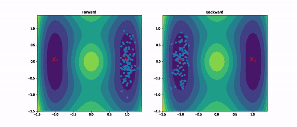

# IPML - Solving Schr\odinger Bridges via Maximum Likelihood.



Pytorch implementations and experiments for arxiv preprint Solving Schr\odinger Bridges via Maximum Likelihood.

## Instalation

In the root directory of this project run

```
$ pip install -e .
```

# Cite

Paper: https://www.mdpi.com/1099-4300/23/9/1134

Bibtex:

```
@Article{e23091134,
AUTHOR = {Vargas, Francisco and Thodoroff, Pierre and Lamacraft, Austen and Lawrence, Neil},
TITLE = {Solving Schrödinger Bridges via Maximum Likelihood},
JOURNAL = {Entropy},
VOLUME = {23},
YEAR = {2021},
NUMBER = {9},
ARTICLE-NUMBER = {1134},
URL = {https://www.mdpi.com/1099-4300/23/9/1134},
ISSN = {1099-4300},
DOI = {10.3390/e23091134}
}
```

# Main Experiments

* See https://github.com/franciscovargas/GP_Sinkhorn/blob/main/notebooks/Well-big-Wall-Algorithmic-Kernels.ipynb for the Well experiments
* See https://github.com/franciscovargas/GP_Sinkhorn/blob/main/script/EB_Dataset.py for the EB Single Cell experiments
* For creating all the data dependencies for the EB dataset download and run notebook at https://nbviewer.jupyter.org/github/KrishnaswamyLab/PHATE/blob/master/Python/tutorial/EmbryoidBody.ipynb .
* For well convergence plots see https://github.com/franciscovargas/GP_Sinkhorn/blob/main/notebooks/plot_well_results.ipynb
* For mocap notebook (a bit messy/unclear) see https://github.com/franciscovargas/GP_Sinkhorn/blob/main/notebooks/GP_Drift_Fit-Lin-Langevin-Dynamics-MOCAP-Reduce.ipynb
